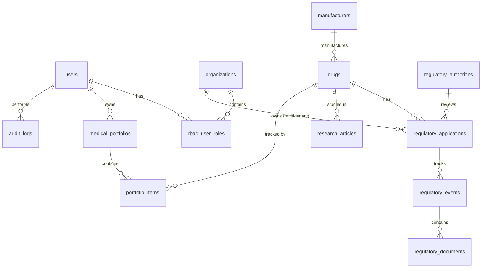

# Phase 3: Database Design (Entity Relationship Model)

Based on the implemented Drizzle schema (`src/db/schema.ts`) and the architectural constraints, this document defines the overarching Database Design strategy.

## 1. Entity Relationship Diagram (ERD)

---

## 2. Entities & Fields Definition

- **`organizations` (Tenants):** `id`, `name`, `created_at`.
- **`users` (Identities):** `id`, `email`, `name`, `isActive`, `created_at`.
- **`rbac_user_roles` (AuthZ):** `userId`, `orgId`, `role` (Admin/Viewer/Editor).
- **`manufacturers` (Entities):** `id`, `name`, `countryHQ`.
- **`regulatory_authorities` (Entities):** `id`, `name` (FDA/EMA), `region`.
- **`drugs` (Core):** `id`, `name`, `activeIngredient`, `manufacturerId`, `globalStatus`, `createdAt`.
- **`regulatory_applications` (Lifecycle):** `id`, `drugId`, `authorityId`, `applicationNumber`, `status`.
- **`regulatory_events` (Timeline):** `id`, `applicationId`, `eventType` (Approval/Warning), `eventDate`.
- **`regulatory_documents` (Storage):** `id`, `eventId`, `title`, `s3ObjectKey`, `mimeType`.
- **`audit_logs` (Security):** `id`, `userId`, `orgId`, `action`, `entityType`, `entityId`, `ipAddress`, `timestamp`.

---

## 3. Relationships & Constraints

- **Multi-Tenancy:** Almost all business entities (like private regulatory drafts) enforce a strict `.references(() => organizations.id)` foreign key constraint.
- **Cascade Rules:** Deleting an organization `CASCADE` deletes its RBAC roles and private drafts. However, global regulatory entities (FDA/EMA/Global Drugs) restrict deletion (`RESTRICT`) if child applications exist to prevent accidental historical data loss.

---

## 4. Indexing Strategy

- **Primary Keys:** Every table uses UUIDv4 (`id`) to prevent sequential ID guessing (Insecure Direct Object Reference).
- **Composite Unique Indexes:** 
  - `drugs` are uniquely constrained by `(name, manufacturerId)` to physically prevent ingestion race conditions.
  - `regulatory_applications` are constrained by `(authorityId, applicationNumber)`.
- **Foreign Key Indexes:** Every foreign key column (e.g., `drugId` inside `regulatory_events`) is individually indexed to prevent slow nested `JOIN` queries.
- **Search Indexes:** Columns like `drugs.name` and `drugs.activeIngredient` are indexed for Postgres `ilike` operations.

---

## 5. Partitioning Considerations (Stage 3 Roadmap)

As defined in the Scalability Roadmap, the `audit_logs` and `regulatory_events` tables will grow extremely fast as automated pipelines ingest decades of FDA data.
- **Partition Key:** `timestamp` (for audit logs) and `eventDate` (for regulatory events).
- **Strategy:** PostgreSQL Native Declarative Partitioning `BY RANGE (timestamp)`. 
- **Execution:** New partitions will be dynamically created per month (e.g., `audit_logs_2026_09`).

---

## 6. Audit Strategy

The `audit_logs` table serves as the immutable system of record.
- **Trigger Level:** High-risk actions (e.g., changing RBAC roles, deleting data, publishing applications) trigger manual insertions into this table via the Node.js Service Layer.
- **Database Level (Future):** If direct database manipulation becomes a risk, Postgres Triggers will be implemented to automatically insert records into `audit_logs` on `UPDATE`/`DELETE` for critical tables.
